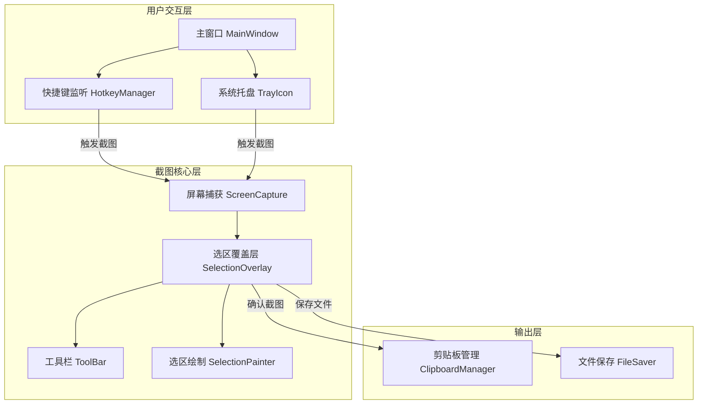
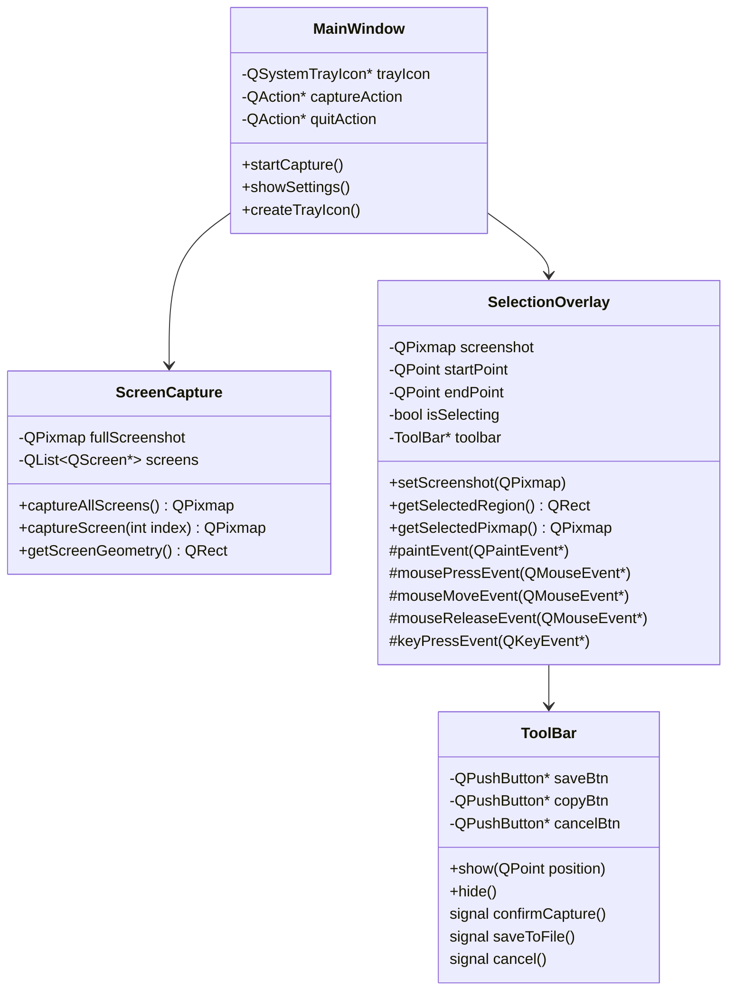
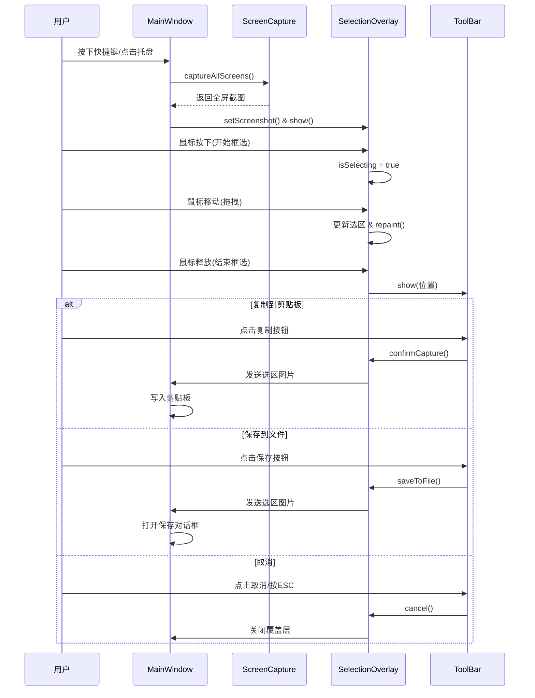

# Qt 框选截图工具 - 项目设计文档

## 1. 系统架构



## 2. 类结构设计



## 3. 核心流程



## 4. UI/UX 规范

### 4.1 颜色规范

| 用途 | 颜色值 | 说明 |
|------|--------|------|
| 遮罩层 | `rgba(0, 0, 0, 0.5)` | 半透明黑色遮罩 |
| 选区边框 | `#409EFF` | 主题蓝色 |
| 选区边框宽度 | `2px` | 清晰可见的边框 |
| 尺寸提示背景 | `rgba(0, 0, 0, 0.7)` | 半透明黑色 |
| 尺寸提示文字 | `#FFFFFF` | 白色文字 |
| 工具栏背景 | `#FFFFFF` | 纯白背景 |
| 工具栏阴影 | `0 2px 12px rgba(0,0,0,0.15)` | 轻微阴影 |
| 按钮悬浮 | `#ECF5FF` | 淡蓝色背景 |

### 4.2 布局规范

- 工具栏圆角：`8px`
- 工具栏内边距：`8px`
- 按钮尺寸：`32x32px`
- 按钮间距：`4px`
- 尺寸提示字体：`12px`

### 4.3 交互规范

| 操作 | 触发方式 | 反馈 |
|------|----------|------|
| 开始截图 | 快捷键 `Ctrl+Alt+A` / 托盘点击 | 全屏遮罩出现 |
| 框选区域 | 鼠标拖拽 | 实时显示选区和尺寸 |
| 调整选区 | 拖拽边角/边缘 | 光标变化提示 |
| 确认截图 | 双击/工具栏按钮 | 成功提示 |
| 取消截图 | `ESC` 键/右键 | 遮罩消失 |

## 5. 文件结构

```
screenshot-tool/
├── CMakeLists.txt              # CMake 构建配置
├── Dockerfile                  # Docker 构建文件
├── src/
│   ├── main.cpp               # 程序入口
│   ├── MainWindow.h           # 主窗口头文件
│   ├── MainWindow.cpp         # 主窗口实现
│   ├── ScreenCapture.h        # 屏幕捕获头文件
│   ├── ScreenCapture.cpp      # 屏幕捕获实现
│   ├── SelectionOverlay.h     # 选区覆盖层头文件
│   ├── SelectionOverlay.cpp   # 选区覆盖层实现
│   ├── ToolBar.h              # 工具栏头文件
│   └── ToolBar.cpp            # 工具栏实现
└── resources/
    └── resources.qrc          # Qt 资源文件
```

## 6. 技术要点

### 6.1 多屏幕支持
- 使用 `QGuiApplication::screens()` 获取所有屏幕
- 计算虚拟桌面的总几何区域
- 支持不同 DPI 的屏幕

### 6.2 高 DPI 支持
- 启用 `Qt::AA_EnableHighDpiScaling`
- 使用 `devicePixelRatio()` 处理缩放

### 6.3 跨平台兼容
- Windows: 使用 Win32 API 注册全局热键
- macOS: 使用 Cocoa API (需要辅助功能权限)
- Linux: 使用 X11/XCB 实现

## 7. 快捷键设计

| 快捷键 | 功能 |
|--------|------|
| `Ctrl+Alt+A` | 开始截图 |
| `ESC` | 取消截图 |
| `Enter` | 确认并复制到剪贴板 |
| `Ctrl+S` | 保存到文件 |
| `Ctrl+C` | 复制到剪贴板 |
